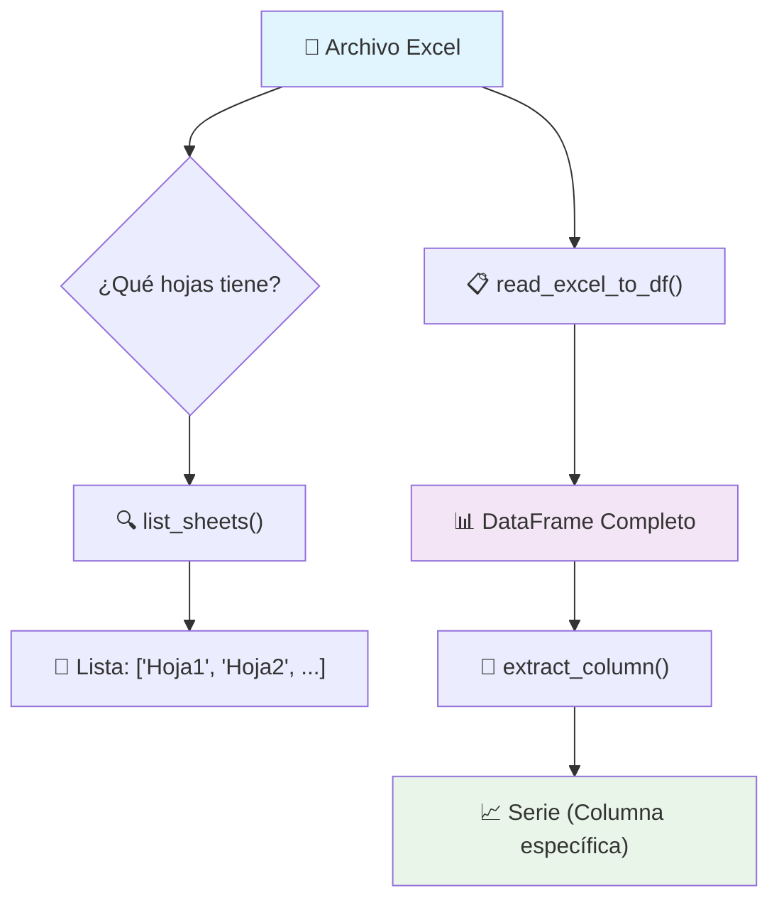

# 📊 excel_utils.py - Documentación Técnica

## 🎯 Propósito
Módulo especializado para la manipulación de archivos Excel en el sistema de control de stock y cobros MecatechDataBase.

---

## 🏗️ Arquitectura de Funciones

```
┌─────────────────────────────────────────────────────────────────┐
│                        EXCEL_UTILS.PY                          │
│                     (Módulo de Utilidades)                     │
└─────────────────────────────────────────────────────────────────┘
                                │
                ┌───────────────┼───────────────┐
                │               │               │
                ▼               ▼               ▼
    ┌─────────────────┐ ┌─────────────────┐ ┌─────────────────┐
    │   list_sheets   │ │ read_excel_to_df│ │ extract_column  │
    │   📝 Explorar   │ │   📋 Cargar     │ │  📌 Filtrar     │
    └─────────────────┘ └─────────────────┘ └─────────────────┘
```

---

## 🔄 Flujo de Datos (Data Pipeline)



---

## 📋 Especificaciones de Funciones

### 🔍 `list_sheets(file_path)`
```
INPUT:  📁 "archivo.xlsx"
OUTPUT: 📜 ["PRECIOS NUEVOS", "STOCK", "RESUMEN"]
TIPO:   str → List[str]
USO:    Reconocimiento inicial del archivo
```

### 📋 `read_excel_to_df(file_path, sheet_name, engine)`
```
INPUT:  📁 "archivo.xlsx" + 📄 "PRECIOS NUEVOS"
OUTPUT: 📊 DataFrame(410 rows × 25 columns)
TIPO:   str × str → pandas.DataFrame
USO:    Carga principal de datos
```

### 📌 `extract_column(df, column_identifier)`
```
INPUT:  📊 DataFrame + 🏷️ Nombre o posición 16
OUTPUT: 📈 Series(410 values)
TIPO:   DataFrame × (str|int) → pandas.Series
USO:    Extracción específica de columnas
```

---

## 🔗 Matriz de Dependencias

| Función           | Entrada Requerida        | Salida Producida    | Siguiente Paso Común    |
|-------------------|--------------------------|---------------------|-------------------------|
| `list_sheets()`   | Archivo Excel           | Lista de nombres    | → `read_excel_to_df()`  |
| `read_excel_to_df()` | Archivo + Hoja       | DataFrame completo  | → `extract_column()`    |
| `extract_column()` | DataFrame + Identificador | Serie específica   | → Análisis/Procesamiento |

---

## 🎨 Representación Visual del Flujo

```
🏪 SISTEMA MECATECH
    │
    ├── 📂 DataBase/
    │   └── 📊 LISTA DE PRECIOS (1).xlsx
    │       ├── 📄 PRECIOS NUEVOS
    │       ├── 📄 STOCK  
    │       └── 📄 RESUMEN
    │
    ├── 🔧 Functions/excel_utils.py
    │   ├── 🔍 list_sheets() ────┐
    │   ├── 📋 read_excel_to_df() ┤ ➤ PIPELINE
    │   └── 📌 extract_column() ──┘
    │
    └── 🖥️ AppBuild/APP.py
        └── 💼 main() [usa todas las funciones]
```

---

## 🚀 Casos de Uso Típicos

### Caso 1: Exploración inicial
```python
# 🔍 ¿Qué hojas tiene el archivo?
hojas = list_sheets("precios.xlsx")
print(f"Hojas: {hojas}")
```

### Caso 2: Carga completa
```python
# 📋 Cargar todo el contenido de una hoja
df = read_excel_to_df("precios.xlsx", "PRECIOS NUEVOS")
print(f"Dimensiones: {df.shape}")
```

### Caso 3: Extracción específica
```python
# 📌 Solo la columna que me interesa
precio_min = extract_column(df, "Q")
print(f"Precios mínimos: {len(precio_min)} valores")
```

### Caso 4: Pipeline completo
```python
# 🔄 Flujo completo automatizado
hojas = list_sheets(archivo)                    # Explorar
df = read_excel_to_df(archivo, hojas[0])       # Cargar
precios = extract_column(df, "Precio minimo")  # Extraer
resultado = precios.sum()                      # Procesar
```

---

## ⚡ Optimizaciones y Consideraciones

### 🎯 Rendimiento
- **`list_sheets()`**: Operación rápida, no carga datos
- **`read_excel_to_df()`**: Operación pesada, carga todo en memoria
- **`extract_column()`**: Operación ligera, solo referencia columna

### 🧠 Memoria
```
Archivo Excel (5MB) 
    ↓ read_excel_to_df()
DataFrame (20MB en RAM)
    ↓ extract_column()  
Serie (2MB en RAM)
```

### 🔒 Manejo de Errores
```python
try:
    df = read_excel_to_df(archivo, hoja)
    columna = extract_column(df, "Q")
except ExcelError as e:
    print(f"Error específico de Excel: {e}")
except Exception as e:
    print(f"Error general: {e}")
```

---

## 📈 Métricas de Uso

| Función | Complejidad | Tiempo Típico | Uso Frecuente |
|---------|-------------|---------------|---------------|
| `list_sheets()` | O(1) | ~50ms | 🟡 Ocasional |
| `read_excel_to_df()` | O(n) | ~500ms | 🔴 Crítico |
| `extract_column()` | O(1) | ~10ms | 🟢 Muy frecuente |

---

## 🔧 Configuración y Dependencias

```python
# Dependencias requeridas
import pandas as pd          # >= 1.0.0
import openpyxl             # Para archivos .xlsx
from typing import Union, List, Optional, Any

# Configuración recomendada
engine = "openpyxl"         # Para archivos .xlsx
encoding = "utf-8"          # Encoding por defecto
```

---

## 📝 Notas de Desarrollo

- **Diseño modular**: Cada función tiene una responsabilidad específica
- **Interoperabilidad**: La salida de una función es entrada válida para la siguiente
- **Robustez**: Manejo exhaustivo de errores con `ExcelError`
- **Flexibilidad**: Soporte para identificación por nombre o posición en `extract_column()`
- **Escalabilidad**: Preparado para agregar más funciones de manipulación Excel